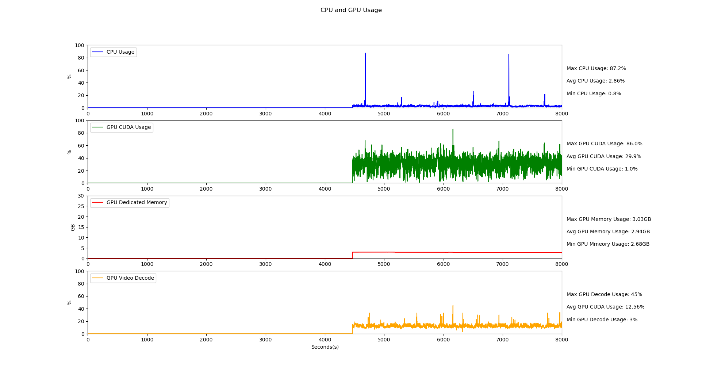

# ResourceMonitor

`ResourceMonitor` 是一個用於監測本地電腦資源使用情況的工具，能實時繪製 CPU、GPU、Memory 等使用狀況的動態圖形，幫助用戶快速了解系統性能負載。

## 功能特色

- **實時監測**：動態顯示 CPU、GPU_Memory/Decode、CUDA的使用率。
- **圖形化展示**：以簡潔的圖形介面展示資源使用狀態。
- **自定義更新間隔**：用戶可設定更新頻率。
  ## 圖形結果範例

     以下是一個工具運行時的結果範例：

*Note：*
- 第一個為 **CPU 使用率** 折線圖，展示每個核心的即時使用情況。
- 第二個為 **GPU CUDA 使用率**，顯示當前 GPU 負載。
- 第三個為 **GPU Memory 使用情況**，展示總記憶體與可用記憶體比例。
- 第四個為 **GPU Decode 使用情況**，展示總記憶體與可用記憶體比例。
- 每張圖旁邊會有最大最小以及平均值
